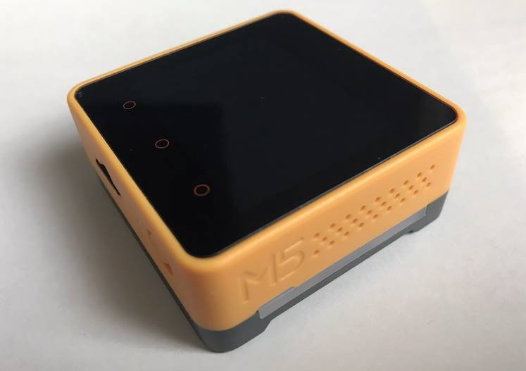
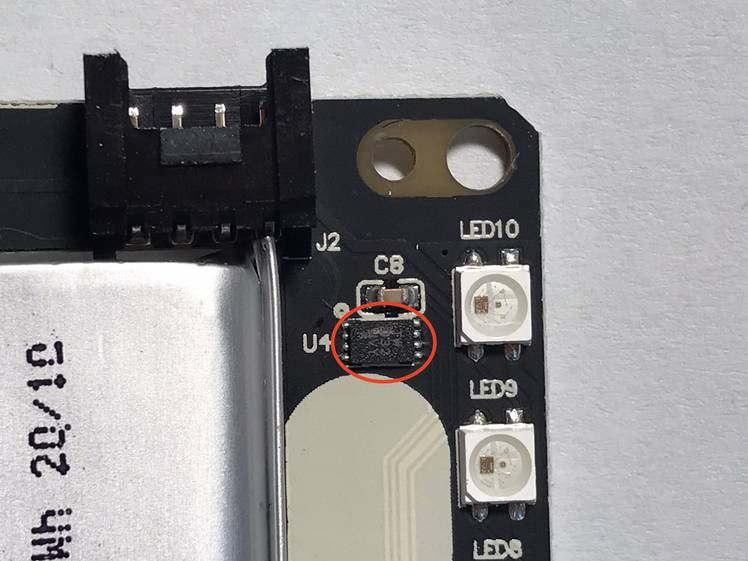
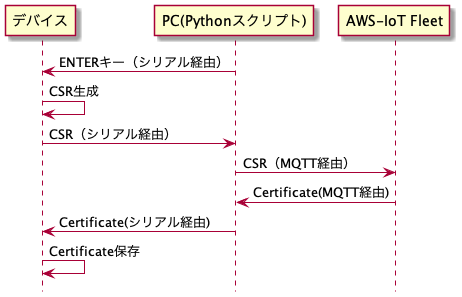
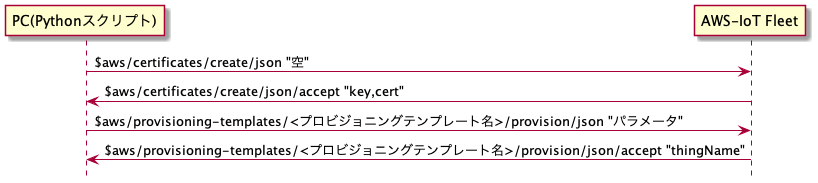
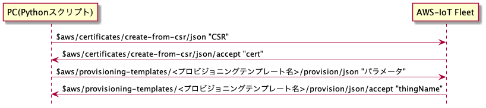

<div class="centering">

{.title}

# セキュアエレメント使った構築事例

## スイッチサイエンス/144Lab 入江田 昇

</div>

====

## M5Stack Core2 for AWS



====

## セキュアエレメント搭載！



====

## Fleet プロビジョニング ２通りの方法

<p class="note">
これを利用し、AWS-IoT の Fleet という機能を利用してデバイス認証用にクライアント証明書を発行、デバイスにインストールして安全にデバイスが AWS-IoT に接続する方法を確立しようと思います。
Fleet によるクライアント証明書発行には２通りの方法があります。
</p>

- #### Fleet がデバイス用秘密鍵と証明書を発行して双方を受け取る方法
- #### CSR を Fleet に送ってデバイス用証明書だけを生成してもらう方法

{.fragment}

### 後者の場合、秘密鍵がネットワークを通らない＆複製ができないのでより安全なクライアント証明書認証が実現できます。<br/>**今回はこの後者の手法を解説します。**

====

## セキュアエレメント（ATECC608）について

- Microchip 社製
- I2C による制御
- 耐タンパー性をもつ
- チップごとにユニークなシリアルナンバーを持つ
- 乱数生成、SHA2 ハッシュ計算
- 内部に閉じた ECC 秘密鍵生成
- 署名と検証機能
- 保存領域の読み出しと書き込み
- スロットごとにプロテクトをかけたり

====

### セキュアエレメントの不揮発領域

<p class="note">
スロット#0 にはマイクロチップ社が出荷時に入れ込んでくれている秘密鍵が入っています（今回はこれを利用しました）。
</p>

- #0~#7: ECC 鍵保存スロット(各スロット 36 バイト)
- #8: ユーザーデータ保存スロット(416 バイト)
- #9~#14: 公開鍵または署名保存スロット(各スロット 72 バイト)

| スロット | 出荷時       | 変更 | サイズ   |
| -------- | ------------ | ---- | -------- |
| #0       | 生成済み     | 不可 | 36bytes  |
| #1       | 特殊用途むけ | 可   | 36bytes  |
| #2..7    | 空           | 可   | 36bytes  |
| #8       | 空           | 可   | 416bytes |
| #9..14   | 空           | 可   | 72bytes  |

#8 以降のスロットに圧縮形式で証明書を１つだけ保存することができる。

====

# 大まかな手順

- 出荷時にプロビジョニング（証明書の発行と保存、モノの登録）
- 運用時に以下の３要素を使って接続（相互認証）

  - ルート CA 証明書
  - デバイス証明書
  - セキュアチップ内の鍵

====

## 出荷時の手順



- セキュアエレメント上で証明書要求（CSR）に生成しシリアル経由で PC に送る
- それを MQTT 経由で Fleet に送り、クライアント証明書を発行してもらう
- 受け取った証明書をシリアル経由でデバイスに送り、その証明書を保存する

====

## 運用時の手順

- 別途デバイスには AWS のルート CA 証明書を保存しておく（今回はファームに埋め込み）
- AWS-IoT 接続時に「ルート CA 証明書」と「セキュアエレメントの秘密鍵」と「保存しておいたクライアント証明書」を使って MQTT 接続する
- <b class="fragment">「双方が証明書の検証に成功する＝相互認証を通った」ということ</b>

====

## 苦渋の SDK ２本立て

<p class="note">
https://github.com/m5stack/Core2-for-AWS-IoT-EduKit が本来使いたかった本家 SDK で、
これだけで完結したかったんですが、CSR（証明書要求）を構築する支援ライブラリがまだなくて、atcacert_create_csr_pem という用意された関数を呼べば作れるのはわかるんですがその CSR の雛形作りが結構ややこしい。
本来 ASN1 エンコードをパースしたり生成したりが別途必要でしたが、その機能が提供されておらず、openssl で生成した雛形バイナリから書くパラメータオフセットを用意して読み込ませる仕掛けでした。
これだと実行時に CSR を構築するのが非常に難しいため、別の方法を模索したところ、
ArduinoECCX08 にはその CSR 雛形を構築する機能があったので今回はこちらを採用しました。
</p>

- デバイスプロビジョニング時は「Arduino で実装したファームウェア」と「Python によるスクリプト」で処理しておき、
- その後「Core2-for-AWS-IoT-EduKit で実装したファームウェア」で運用することにしました。

====

## AWS-IoT Fleet Provisionig

<p class="note">
デバイスのプロビジョニングには AWS-IoT の Fleet（MQTT ベースのプロビジョニング API セット）を利用します。</p>

プロビジョニングガイドはこちら。
https://docs.aws.amazon.com/iot/latest/developerguide/iot-provision.html

大元のサンプルコードはこちら。
https://github.com/aws-samples/aws-iot-fleet-provisioning

====

### このサンプルコードを動かすのに必要な準備は

- AWS-IoT にてプロビジョニングテンプレートの作製
- [AWS ルート CA 証明書](https://www.amazontrust.com/repository/)の取得と config.ini への反映
- プロビジョニング処理を行う際に使う MQTT 接続用のプロビジョニング権限を持ったクライアント証明書と秘密鍵の発行とスクリプトへの設定（サンプルコードの config.ini で参照できる様にする）

====

## サンプルコードの挙動

サンプルコードのままだと「秘密鍵」と「クライアント証明書」を生成して保存するスクリプトになっています。



====

## CSR によるプロビジョニング

元の挙動を改造して以下の様に変更します。



- デバイスで生成した CSR を Fleet に送り、デバイス個体用のクライアント証明書を発行してもらう
- 受け取った証明書をデバイスに送って保存させる
- デバイスを IoT のモノとして登録します

{.fragment}
元の挙動では登録の後、新しい証明書で接続テストを行いますが、改造版では秘密鍵がデバイスにしかなく、Python スクリプトから接続試験はできませんのでコメントアウトしました。

====

## デバイス側のプロビジョニング処理

- セキュアエレメントに保存済みの秘密鍵を利用して CSR を構築（コモンネームにデバイスシリアルをセット）
- それをシリアルポートに出力して PC 側 Python スクリプトに送る
- シリアルポート受信にて証明書を受け取り NVS 領域に保存する

====

### Arduino ライブラリのインストール

一般公開の「ArduinoECCX08」ライブラリを「M5Stack Core2 for AWS」向けに調整したソースコードが別途以下の URL に公開されています。

https://github.com/m5stack/M5Core2/tree/master/examples/core2_for_aws

にて `ArduinoECCX08.zip` をダウンロードして「Arduino ライブラリフォルダ」または「Arduino プロジェクトの src/フォルダ」配下に展開しておきます。

====

```cpp
#include <M5Core2.h>
#include "src/ArduinoECCX08/ArduinoECCX08.h"
#include "src/ArduinoECCX08/utility/ECCX08CSR.h"
#include "src/ArduinoECCX08/utility/ECCX08DefaultTLSConfig.h"

String readline() {
  static char buff[1024];
  buff[0] = 0;
  char *ptr = buff;
  while (1) {
    char ch = Serial.read();
    if (ch > 0x7e) {
      delay(10);
      continue;
    }
    Serial.write(ch);
    if (ch == '\n') {
      *(ptr) = 0;
      break;
    } else if (ch != '\r') {
      *(ptr++) = ch;
    }
  }
  return String(buff);
}

#define PKEY_SLOT 0

String serialNumber = ECCX08.serialNumber();
  if (!ECCX08CSR.begin(PKEY_SLOT, false)) {
    Serial.println("Error starting CSR generation!");
    while (1) delay(100);
  }
ECCX08CSR.setCountryName("JP");
ECCX08CSR.setCommonName(serialNumber);
String csr = ECCX08CSR.end();

// -> PCに生成したCSRを送信(空行がデータの終わり)
Serial.println(csr); Serial.println();

String certificate = "";
Serial.println("entry signed certificate and press enter key:");
// PCからシリアルポート経由で証明書を受け取る(空行がデータの終わり)
for (String in = readline(); in.c_str()[0] != 0; in = readline()) {
    certificate += in + "\n";
}

// 証明書内容PEM文字列をNVSに保存
static uint32_t nvsHandle;
nvs_flash_init();
nvs_open("parameters", NVS_READWRITE, &nvsHandle);
nvs_set_blob(nvsHandle, "certificate", certificate.c_str(), certificate.length());
nvs_close(nvsHandle);
```

====

## 運用ファームウェア側の接続処理

サンプルコードの記述との違いは以下の２行だけ。
`#0`は ECC 鍵スロット 0 を利用する指定で、`デバイス証明書のPEM文字列`は NVS 領域から読み出した PEM 文字列です。

```c
mqttInitParams.pDeviceCertLocation = "デバイス証明書のPEM文字列"
mqttInitParams.pDevicePrivateKeyLocation = "#0"
```

====

<div class="centering">

# ハマりポイント

</div>

====

### プロビジョニングまわり(1)

- プロビジョニングの config.ini は注意深く設定しましょう AWS-IoT 側のテンプレート名と合わせるのをお忘れなく
- プロビジョニング用に発行するクレーム証明書に必要な以下の権限に注意。
  - "iot:Connect"
  - "iot:Publish"
  - "iot:Receive"
  - "iot:Subscribe"

====

### プロビジョニングまわり(2)

- 関連するトピックの URI は以下の３つ(############ は AWS ユーザー ID）
  - "arn:aws:iot:ap-northeast-1:############:topic/$aws/certificates/create/\*"
  - "arn:aws:iot:ap-northeast-1:############:topic/$aws/certificates/create-from-csr/\*"
  - "arn:aws:iot:ap-northeast-1:############:topic/$aws/provisioning-templates/<プロビジョニングテンプレート名>/provision/\*"

====

### プロビジョニングまわり(3)

- クレーム(ブートストラップ)証明書は権限が大きめなので漏洩に注意しましょう
- プロビジョニング時のデバイス個別証明書に与える権限（プロビジョニングテンプレートの設定）はデバイスの運用に必要な最小限の権限に絞っておきましょう

====

### デバイス側の注意点

- ArduinoSDK 時のフラッシュメモリの NVS パーティションと Core2 for AWS SDK の NVS パーティションを合わせておく必要があります
- NVS は書き込み続けるといずれ書き込めなくなりますので出荷処理の前にフラッシュイレースを推奨します

====

## まとめ

- プロビジョニングを Arduino で、実運用を M5Stack Core2 for AWS SDK にて実装しました
- 秘密鍵をセキュアエレメントに閉じたまま AWS-IoT との接続を安全に確立することができました
- この方法のメリットは秘密鍵の複製が困難で証明書の複製が該当デバイス以外で使えないこと
- この方法のデメリットは出荷時スクリプトに強力な権限を持たせるのでその漏洩に注意しなければならないところ

====

<div class="centering">

# 質問？

</div>

====

<div class="centering">

{.title}

# おわり

</div>
